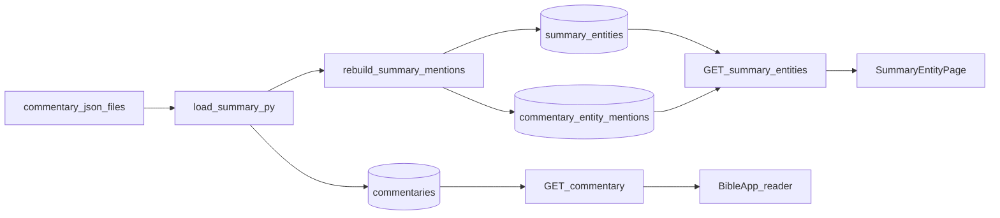

# Chapter summary system

This document describes how **chapter summaries**, **summary-derived entities** (themes, people, places), and **entity detail pages** fit together in the codebase: data flow, storage, APIs, reader UI, and navigation—including how clicking a tag from the reader opens an entity page that can show overview text, timeline, scripture references across chapters, and an optional chapter-specific blurb when the user arrived from a given chapter.

---

## 1. Purpose and scope

### Chapter summaries (reader side panel)

- Chapter summaries are a **commentary source** with `source = summary` in the database. The user selects **Chapter Summaries** in the commentary source dropdown; the app loads that source like any other commentary.
- **They are not generated per request.** Prose and structured fields are **authored offline**, stored as JSON in the repo, and **batch-loaded** into Supabase (see [Authoring and batch load](#2-authoring-and-batch-load)).
- The side panel shows the stored **title**, **summary body**, **key points**, **themes**, **key people**, **key places** (when present), and **supporting verses**, parsed from a single `content` string.

### Entity pages (theme / person / place)

- Routes such as `/themes/{slug}`, `/people/{slug}`, and `/places/{slug}` render [`SummaryEntityPage`](../frontend-next/src/components/SummaryEntityPage.tsx).
- Those pages load **which chapters reference** each entity from the database (the **Scripture references** section). That index is built from summary commentary and entity mentions (see [Database model](#4-database-model)).
- **Separate from stored chapter JSON:** the **overview** paragraph, **timeline** (people/places), and optional **“In {book} {chapter}”** strip are loaded today via **AI endpoints** (`/api/v1/ai/entity-content` and `/api/v1/ai/chat`). Do not confuse that with the static chapter summary text in the reader.

---

## 2. Authoring and batch load

### Source files

- **Directory:** [`commentary/`](../commentary/) — JSON files (often one per biblical book). Each array element describes **one chapter** with fields such as `book_number`, `chapter`, `title`, `summary_text`, `themes`, `key_people`, `key_points`, `supporting_verses`, and optionally `key_places` (or inferred places; see the loader).

### Loader script

- **Script:** [`scripts/load_summary.py`](../scripts/load_summary.py).
- **Steps (simplified):**
  1. Read all `*.json` under `commentary/`.
  2. For each entry, build a single `content` string with [`format_content()`](../scripts/load_summary.py) (see [Stored `content` format](#3-stored-content-format-contract)).
  3. Upsert [`commentary_sources`](../scripts/load_summary.py) with id `summary` (name “Summary”, license, description).
  4. **Delete** existing rows in `commentaries` where `source = summary`, then **insert** new rows in batches.
  5. Call [`rebuild_all_summary_mentions()`](../app/services/summary_entity_service.py) to rebuild `summary_entities` / `commentary_entity_mentions` from the new content. If that fails, the script prints a warning (e.g. run a backfill script later).

**Requirements:** `SUPABASE_URL` and `SUPABASE_SERVICE_ROLE_KEY` in `.env` (see script docstring).

---

## 3. Stored `content` format (contract)

The loader and the reader agree on a **line-oriented** plain-text layout. The loader emits it; the reader parses it in [`parseSummaryContent`](../frontend-next/src/components/BibleApp.tsx).

| Section | Format |
|--------|--------|
| Title (optional) | First line: `TITLE::{title}` |
| Summary body | Prose after the title block, **before** any `Themes:` / `Key People:` / … line |
| Themes | Line: `Themes: A · B · C` (middle dot separators) |
| Key people | Line: `Key People: …` (same separator style) |
| Key places | Line: `Key Places: …` |
| Key points | `Key Points:` then lines starting with `• ` |
| Supporting verses | Line: `Supporting Verses: …` |

This string is what gets stored in `commentaries.content` for `source = summary`.

---

## 4. Database model

### `commentaries`

- Rows for chapter summaries use `source = 'summary'`, plus `book_number`, `chapter`, and verse range.
- The loader sets **`verse_start = 1`** and **`verse_end = null`** for chapter-level summaries.

### `commentary_sources`

- One row for the Summary source (id `summary`), registered by `load_summary.py`.

### `summary_entities` and `commentary_entity_mentions`

- **Schema:** [`supabase/migrations/20250411000012_012_summary_entities.sql`](../supabase/migrations/20250411000012_012_summary_entities.sql) creates:
  - **`summary_entities`:** `kind` (check constraint includes **theme** and **person** in the migration), `slug`, `label`, uniqueness on `(kind, slug)` and `(kind, label)`.
  - **`commentary_entity_mentions`:** many-to-many between `commentaries.id` and `summary_entities.id`, primary key `(commentary_id, entity_id)`.

- **Application behavior:** [`summary_entity_service.py`](../app/services/summary_entity_service.py) also supports **`place`** as a kind for API routes and UI. Place indexing may use DB rows or a documented fallback path depending on feature flags—see the service for `place` and `_PLACE_ENTITY_INDEXING_ENABLED`.

**Purpose of mentions:** each link means “this chapter summary commentary row is tagged with this entity.” That powers entity pages: **all chapters where a theme/person/place appears** are listed as **references**.

---

## 5. Backend services and APIs

### Commentary (reader)

- **Service:** [`get_commentary`](../app/services/commentary_service.py) queries `commentaries` by book, chapter, and optional `source`.
- For entries with `source = summary`, it enriches rows with **`theme_tags`**, **`people_tags`**, and **`place_tags`** (slugs + labels) via `fetch_tags_for_commentary_ids`, so the frontend can render **clickable** links.

### HTTP

- **`GET /api/v1/commentary`** — query params: `book`, `chapter`, optional `verse`, optional `source` (e.g. `summary`). Implemented in [`app/main.py`](../app/main.py).
- **`GET /api/v1/summary-entities/list/{kind}`** — `kind` is `theme`, `person`, or `place`; returns a list for bank pages. Cache header `max-age=300`.
- **`GET /api/v1/summary-entities/{kind}/{slug}`** — implemented by [`get_summary_entity_page()`](../app/services/summary_entity_service.py). Returns `kind`, `slug`, `label`, and **`references`**: an array of `{ commentary_id, book_number, book_name, chapter }` sorted by book then chapter. This is the data for the **Scripture references** grid on the entity page (“other chapters”).

---

## 6. Reader UI (`BibleApp.tsx`)

When the active commentary source is **`summary`** (`commentarySource === 'summary'`), [`renderCommentaryContent`](../frontend-next/src/components/BibleApp.tsx):

1. Maps each commentary `entry` through **`parseSummaryContent(entry.content)`** to get structured fields.
2. Renders title, summary text, key points, themes, people, places, and supporting verses in dedicated blocks.

### Tags vs plain text

- If **`entry.theme_tags`** / **`people_tags`** / **`place_tags`** are present (from the API), each tag renders as a **Next.js `<Link>`** to:
  - `/themes/{slug}`
  - `/people/{slug}`
  - `/places/{slug}`
- If tags are missing, the UI falls back to the **parsed plain strings** from the `Themes:` / `Key People:` / `Key Places:` lines as **non-link** chips.

Some labels are filtered out for people/places (e.g. abstract words) so the UI stays clean—see **`ENTITY_SKIP_LABELS`** / **`PLACE_ABSTRACT_LABELS`** in the same file.

---

## 7. Navigation: preserving reader context (`returnTo`)

From the chapter summary panel, links to entities and bank pages include a **query parameter** that records where to return in the reader.

### `entityNavSuffix`

Built when rendering summary commentary (see `entityNavSuffix` in [`BibleApp.tsx`](../frontend-next/src/components/BibleApp.tsx)):

- Format: `?returnTo=` + **URL-encoded** path, typically:
  - `/app?book={BookName}&chapter={n}&panel=commentary&source=summary`
- Appended to:
  - `/themes/{slug}`, `/people/{slug}`, `/places/{slug}`
  - `/themes/bank`, `/people/bank`, `/places/bank`

### How `SummaryEntityPage` uses it

[`SummaryEntityPage`](../frontend-next/src/components/SummaryEntityPage.tsx) reads the query string:

- **`returnTo`** → passed to **`safeReaderReturnHref`** for the **← Reader** back link (only allows safe same-origin paths such as `/app?...`).
- **`parseChapterContext(returnTo)`** — if `returnTo` contains `book` and `chapter`, the page shows **In {book} {chapter}** at the top. For **person** and **place**, that context triggers loading a **short chapter-specific blurb** (currently via **`POST /api/v1/ai/chat`**). Themes do not use that chapter strip the same way.

So: **clicking a person or place from the summary** opens the entity page **with the same reader location encoded**, which restores context when going back and can specialize the top section for that chapter.

---

## 8. Entity routes (Next.js App Router)

| Route | File | Component |
|-------|------|-----------|
| `/themes/[slug]` | [`frontend-next/src/app/themes/[slug]/page.tsx`](../frontend-next/src/app/themes/[slug]/page.tsx) | `<SummaryEntityPage kind="theme" slug={slug} />` |
| `/people/[slug]` | [`frontend-next/src/app/people/[slug]/page.tsx`](../frontend-next/src/app/people/[slug]/page.tsx) | `kind="person"` |
| `/places/[slug]` | [`frontend-next/src/app/places/[slug]/page.tsx`](../frontend-next/src/app/places/[slug]/page.tsx) | `kind="place"` |
| Bank listings | `themes/bank`, `people/bank`, `places/bank` | List UIs calling **`GET /api/v1/summary-entities/list/{kind}`** |

---

## 9. What the entity page shows (current behavior)

[`SummaryEntityPage`](../frontend-next/src/components/SummaryEntityPage.tsx) does the following after mount:

1. **`GET /api/v1/summary-entities/{kind}/{slug}`** — entity label and **references** (chapters).
2. **Overview** — **`POST /api/v1/ai/entity-content`** with a description prompt (theme/person/place wording differs). Not read from chapter JSON.
3. **Timeline** — for **`person`** and **`place`**, **`POST /api/v1/ai/entity-content`** with a prompt that asks for JSON-shaped timeline data; the client parses and renders **`VerticalTimeline`**. On failure, **fallback timelines** are built from references or small hard-coded cases.
4. **Chapter strip** — if `returnTo` parsed to a book/chapter, and kind is person or place: **`POST /api/v1/ai/chat`** for a focused “in this chapter” paragraph.
5. **Scripture references** — bottom section: links to **`/app?book=...&chapter=...`** for every indexed chapter so users can jump to **other chapters** where that entity appears.
6. **Ask AI** — optional collapsible chat using **`POST /api/v1/ai/chat`** with bible context seeded from the first reference.

### Person page: overview prompt (`buildDescriptionPrompt`)

The **About / Summary** paragraph on a person entity page is requested with **`POST /api/v1/ai/entity-content`**. The prompt string is built in [`buildDescriptionPrompt`](../frontend-next/src/components/SummaryEntityPage.tsx) when `kind === 'person'`. `{label}` is the entity’s display name (e.g. `Moses`).

```
In 4–6 sentences, describe who {label} is in the Bible. Include a brief historical timeline in prose: their background, the major events they are involved in in chronological flow, and how their role or significance develops over time. End with why they matter to the biblical story. Write in flowing prose without listing verse citations like "Genesis 12:1" in the text.
```

(Themes and places use different sentences in the same function; only the **person** branch is shown above.)

### Person page: timeline prompt (`buildTimelinePrompt`)

The **Timeline** section for a person uses another **`POST /api/v1/ai/entity-content`** call with a longer prompt from [`buildTimelinePrompt`](../frontend-next/src/components/SummaryEntityPage.tsx) (`kind === 'person'`). `{label}` is the person’s name; `{refContext}` is produced by [`buildTimelineReferenceContext`](../frontend-next/src/components/SummaryEntityPage.tsx) from indexed scripture references (up to 14 book/chapter spans, e.g. `Exodus 2; Exodus 3-4`).

```
Return ONLY valid JSON (no markdown) with shape {"events":[{"era":"...","title":"...","summary":"...","developments":["..."],"significance":"..."}]}. Build a highly specific chronological life timeline for {label} with 10-14 milestones. Use book/chapter progress for chronology, not calendar dates. Requirements per event: (1) "era" must be book/chapter based, like "Exodus 1-2" or "Deuteronomy 31-34", (2) "title" must be a concrete life-phase or event title, (3) "summary" must be 2-3 sentences describing what happens in Scripture and why this changes the person's role, (4) "developments" must have 3-5 concrete details with explicit scriptural anchors like "(Exodus 3-4)", (5) "significance" must be 1-2 sentences. Avoid vague wording entirely. If {label} is a major biblical figure (for example Moses, David, Abraham, Peter, Paul), include the best-known narrative milestones in canonical order (birth/early life, calling, major conflicts, leadership moments, covenant moments, failures, transition, and legacy where applicable). Indexed reference context: {refContext}.
```

The model is asked for **raw JSON only**; the client still strips accidental `` ```json `` fences if present before parsing.

### HTTP JSON: `entity-content` (overview and timeline)

Both overview and timeline use the same endpoint and Pydantic models ([`EntityContentRequest` / `EntityContentResponse`](../app/schemas/ai.py)).

**Request body (JSON):**

```json
{
  "prompt": "<string built by buildDescriptionPrompt or buildTimelinePrompt>",
  "max_tokens": 500
}
```

Use **`max_tokens`: 500** for the overview and **`max_tokens`: 3500** for the timeline (see [`SummaryEntityPage`](../frontend-next/src/components/SummaryEntityPage.tsx)).

**Response body (JSON):**

```json
{
  "content": "<string>"
}
```

For the **overview**, `content` is **plain prose** (not JSON).

For the **timeline**, `content` is normally a **single string** whose value is JSON text (what you get from `JSON.stringify` on the timeline object). Example (abbreviated):

```json
{
  "content": "{\"events\":[{\"era\":\"Exodus 1-2\",\"title\":\"Birth under oppression\",\"summary\":\"...\",\"developments\":[\"...\"],\"significance\":\"...\"}]}"
}
```

After trimming optional markdown code fences, [`parseTimelinePayload`](../frontend-next/src/components/SummaryEntityPage.tsx) parses that string as JSON, with the shape below.

### JSON shape: timeline (person) — inside `content`

The parser ([`parseTimelinePayload`](../frontend-next/src/components/SummaryEntityPage.tsx)) expects an object with an **`events`** array. Each event may use legacy aliases (`period` instead of `era`, `detail` instead of `summary`).

```json
{
  "events": [
    {
      "era": "Exodus 1-2",
      "title": "Birth under oppression",
      "summary": "Two or three sentences describing what happens in Scripture and how it changes the person's role.",
      "developments": [
        "Concrete detail with anchor (Exodus 1)",
        "Another detail (Exodus 2:1-10)"
      ],
      "significance": "One or two sentences on why this milestone matters."
    }
  ]
}
```

**Fields used after normalization:**

| Field | Notes |
|--------|--------|
| `era` | Prefer `era`; `period` is accepted as fallback |
| `title` | Required for display (with `summary`) |
| `summary` | Required; `detail` accepted as fallback |
| `developments` | Array of strings; up to 5 kept per event |
| `significance` | Optional |

Events without both `title` and `summary` are dropped; at most **12** events are kept after parsing.

### JSON shape: overview (person) — not nested JSON

There is **no** structured JSON for the overview text: it is the **entire** `content` string returned by the API, shown as the overview paragraph. If you pre-generate or cache it, storing `{"overview": "<prose string>"}` or the raw string alone is enough; the live app only reads **`EntityContentResponse.content`** as text.

---

## 10. End-to-end data flow



---

## 11. Quick reference

| Concern | Primary location |
|--------|------------------|
| Chapter summary text (authoring → DB) | [`commentary/*.json`](../commentary/), [`scripts/load_summary.py`](../scripts/load_summary.py), `commentaries` rows with `source = summary` |
| Entity graph and mention index | [`summary_entity_service.py`](../app/services/summary_entity_service.py), [`supabase/migrations/20250411000012_012_summary_entities.sql`](../supabase/migrations/20250411000012_012_summary_entities.sql) |
| Reader: parse and render summary | [`BibleApp.tsx`](../frontend-next/src/components/BibleApp.tsx) — `parseSummaryContent`, `renderCommentaryContent` when `commentarySource === 'summary'` |
| Entity page UI + `returnTo` | [`SummaryEntityPage.tsx`](../frontend-next/src/components/SummaryEntityPage.tsx) |
| API routes | [`app/main.py`](../app/main.py) — `/api/v1/commentary`, `/api/v1/summary-entities/...` |

---

## Related reading

- App README architecture overview: [`README.md`](../README.md) (AI agents vs commentary — chapter summaries align with **commentary** + **entity** features described here).
